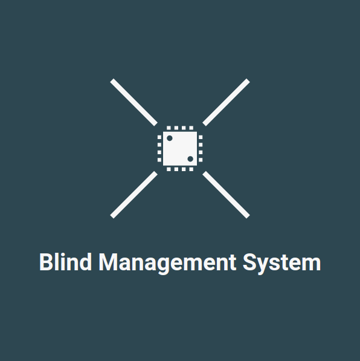
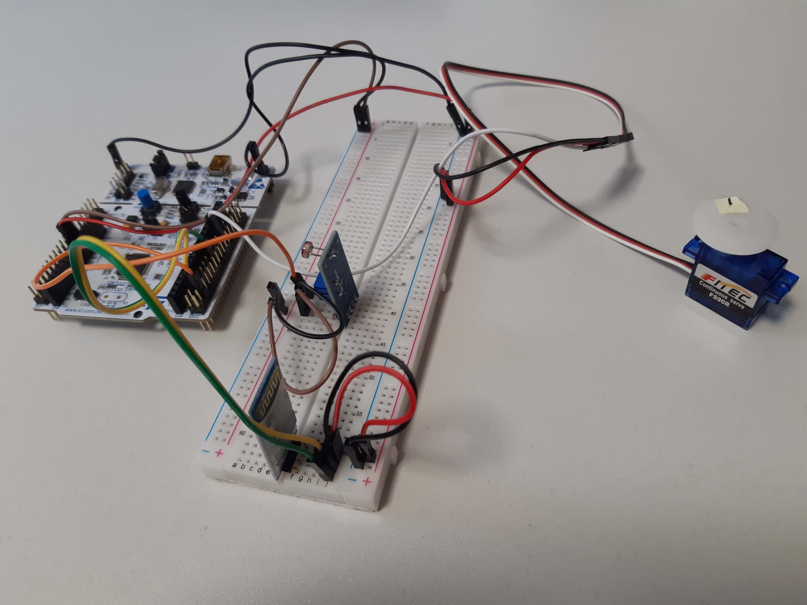
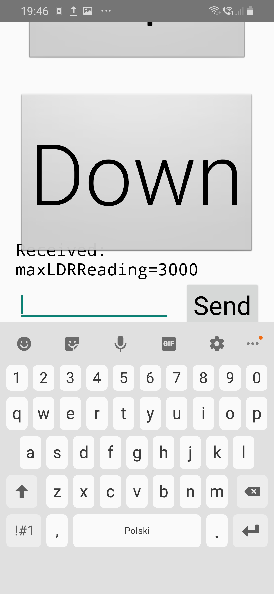
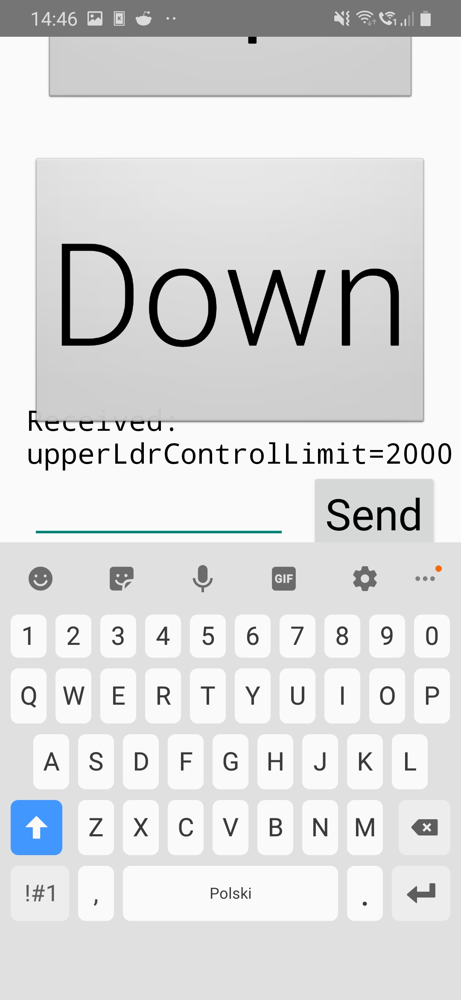

<div id="top"></div>

[![Contributors][contributors-shield]][contributors-url] [![Forks][forks-shield]][forks-url] [![Stargazers][stars-shield]][stars-url] [![Issues][issues-shield]][issues-url] [![MIT License][license-shield]][license-url]


<!-- PROJECT LOGO -->
<br />
<div align="center">
  <a href="https://github.com/dg1asap/BlindManagementSystem">
    
  </a>

  <h3 align="center">BlindManagementSystem</h3>

  <p align="center">
Window roller blind management system
    <br />
    <a href="https://github.com/dg1asap/BlindManagementSystem">
    <br />
    <br />
    <a href="https://www.youtube.com/watch?v=koArA3Z6Q7I">View Demo</a>
    ·
    <a href="https://github.com/dg1asap/BlindManagementSystem/issues">Report Bug</a>
    ·
    <a href="https://github.com/dg1asap/BlindManagementSystem/issues">Request Feature</a>
  </p>
</div>


<!-- TABLE OF CONTENTS -->
<details>
  <summary>Table of Contents</summary>
  <ol>
    <li>
      <a href="#about-the-project">About The Project</a>
      <ul>
        <li><a href="#built-with">Built With</a></li>
      </ul>
    </li>
    <li>
      <a href="#getting-started">Getting Started</a>
      <ul>
        <li><a href="#prerequisites">Prerequisites</a></li>
        <li><a href="#installation">Installation</a></li>
      </ul>
    </li>
    <li><a href="#modules-used">Modules Used</a></li>
    <li><a href="#android-application-support">Android Application Support</a></li>
    <li><a href="#roadmap">Roadmap</a></li>
    <li><a href="#contributing">Contributing</a></li>
    <li><a href="#license">License</a></li>
    <li><a href="#contact">Contact</a></li>
    <li><a href="#acknowledgments">Acknowledgments</a></li>
  </ol>
</details>


<!-- ABOUT THE PROJECT -->
## About The Project



BlindManagmentSystem is a project created by two students of the Warsaw University of Technology as part of an additional course - PMIK (Microcontrollers Programming) The system manages such modules as Servo with continuous operation 360°, Photoresistor and Bluetooth. In the future, we also want to add a humidity sensor module. The simplified description of the system operation consists of three modes: schedule, exposure and manual

In <strong>schedule mode</strong>, the roller shutter opens or closes at the set times as planned. The schedule is sent to the system with Bluetooth using the Android application. The microcontroller stores data in memory and counts down the time. If the clock shows the time from the schedule, the roller shutter is running

In <strong>exposure mode</strong>, the light intensity is periodically measured and compared with limiting intensity. Depending on the result of the comparison, the servo will activate the roller shutter. When the intensity exceeds the limit intensity, the roller shutter will be lowered, otherwise it will be raised. The current limits are set using the Android application and sent to the microcontroller via the Bluetooth module

In <strong>manual mode</strong>, the user roll up or roll down the blind using the Android application


<p align="right">(<a href="#top">back to top</a>)</p>


### Built With

* [STM32CubeIDE](https://www.st.com/en/development-tools/stm32cubeide.html)
* [Android](https://www.android.com)


<p align="right">(<a href="#top">back to top</a>)</p>


<!-- GETTING STARTED -->
## Getting Started

### Prerequisites

Download and install the software below
* [STM32CubeIDE](https://www.st.com/en/development-tools/stm32cubeide.html)
* [AndroidStudio](https://developer.android.com/studio)

### Installation

1. Clone the repo
   ```sh
   git clone https://github.com/dg1asap/BlindManagementSystem.git
   ```
   
2. If you use other MCU than STM32L073RZ,
using STM32CubeIDE to change the pins in the file ```curtain-manage-prototype.ioc``` to match the MCU you selected. Do not change anything if you use the same equipment as us. A description of the equipment we use can be found in the Modules Used tab

3. Upload the software to the microcontroller by connecting MCU to the computer and clicking on the green arrow (Run) on the STM32CubeIDE bar

4. Using AndroidStudio upload the application to your phone, follow [instruction](https://developer.android.com/studio/run/device). <strong>Important!</strong> Before uploading the software to your phone, remember to enable developer options on your phone. Depending on your phone model, this process will vary. In our case, it was a few times clicking on the build number


<p align="right">(<a href="#top">back to top</a>)</p>

<!-- MODULESUSED -->
## Modules Used

* [Bluetooth](https://kamami.pl/moduly-bluetooth/198260-modul-hc-06-20edr.html)
* [Photoresistor](https://kamami.pl/czujniki-swiatla-i-koloru/587462-modul-z-czujnikiem-natezenia-swiatla-fotorezystor.html)
* [360° Continuous Servo](https://kamami.pl/serwa-micro/558108-feetech-fs90r-micro-servo-pracy-ciaglej-360-pololu-2820.html)
* [STM32L073RZ MCU](https://www.st.com/en/evaluation-tools/nucleo-l073rz.html)

<!-- ANDROIDAPPLICATIONSUPPORT -->
## Android Application Support

 

The Up and Down buttons are used to roll up and roll down the roller blind in manual mode. The chat at the bottom of the application is used to set parameters
and stream them via Bluetooth

#### Command List:
```
SERWO MAX UP
SERWO MAX DOWN
SERWO UP
SERWO DOWN
SET MIN LDR READING xxxx
SET MAX LDR READING xxxx
SET UPPER LDR CONTROL LIMIT xxxx
SET LOWER LDR CONTROL LIMIT xxxx
SET SERVO MAX POSITION xxxx
PRINT MIN LDR READING
PRINT MAX LDR READING
PRINT UPPER LDR CONTROL LIMIT
PRINT LOWER LDR CONTROL LIMIT
PRINT SERVO MAX POSITION
TIMER UP xxxx
TIMER DOWN xxxx
LDR TURN ON
LDR TURN OFF
SCHEDULER UP ON
SCHEDULER UP OFF
SCHEDULER DOWN ON
SCHEDULER DOWN OFF
RTC TIME
```

More information about the system itself and the description of commands can be found in the documentation in ```doc```


<p align="right">(<a href="#top">back to top</a>)</p>


<!-- ROADMAP -->
## Roadmap

* [x] Photoresistor module support
    * [x] Lighting of the diode in the event of exceeding the light intensity

* [x] Servo module support with 360 ° continuous support
    * [x] Rolling or unrolling the blind depending on the reading from the photoresistor
    
* [x] Creation of an application on Android and Bluetooth support
    * [x] Rolling or unrolling the blind with the Android application
    * [x] Setting system parameters using the Android application
    * [x] Setting the Bluetooth commands on the microcontroller side
* [x] Writing and generating documentation


<p align="right">(<a href="#top">back to top</a>)</p>


<!-- CONTRIBUTING -->
## Contributing

Contributions are what make the open source community such an amazing place to learn, inspire, and create. Any contributions you make are **greatly appreciated**

If you have a suggestion that would make this better, please fork the repo and create a pull request. You can also simply open an issue with the tag "enhancement".
Don't forget to give the project a star! Thanks again!

1. Fork the Project
2. Create your Feature Branch (`git checkout -b feature/AmazingFeature`)
3. Commit your Changes (`git commit -m 'Add some AmazingFeature'`)
4. Push to the Branch (`git push origin feature/AmazingFeature`)
5. Open a Pull Request

<p align="right">(<a href="#top">back to top</a>)</p>


<!-- LICENSE -->
## License

Distributed under the Apache License 2.0. See `LICENSE.txt` for more information

<p align="right">(<a href="#top">back to top</a>)</p>


<!-- CONTACT -->
## Contact

dg1asap - dg_1@wp.pl

depegie - dan.mierzej@gmail.com

Project Link: [https://github.com/dg1asap/BlindManagementSystem](https://github.com/dg1asap/BlindManagementSystem)

<p align="right">(<a href="#top">back to top</a>)</p>


<!-- ACKNOWLEDGMENTS -->
## Acknowledgments

* <strong>Very Important</strong> 90% of the code on Android apps is from [viktorvano](https://github.com/viktorvano/Bluetooth-for-STM32-and-Android). If you use our system, thank him and give him a star
* [Img Shields](https://shields.io)

<p align="right">(<a href="#top">back to top</a>)</p>


<!-- MARKDOWN LINKS & IMAGES -->
<!-- https://www.markdownguide.org/basic-syntax/#reference-style-links -->
[contributors-shield]: https://img.shields.io/github/contributors/dg1asap/BlindManagementSystem.svg?style=for-the-badge
[contributors-url]: https://github.com/dg1asap/BlindManagementSystem/graphs/contributors
[forks-shield]: https://img.shields.io/github/forks/dg1asap/BlindManagementSystem.svg?style=for-the-badge
[forks-url]: https://github.com/dg1asap/BlindManagementSystem/network/members
[stars-shield]: https://img.shields.io/github/stars/dg1asap/BlindManagementSystem.svg?style=for-the-badge
[stars-url]: https://github.com/dg1asap/BlindManagementSystem/stargazers
[issues-shield]: https://img.shields.io/github/issues/dg1asap/BlindManagementSystem.svg?style=for-the-badge
[issues-url]: https://github.com/dg1asap/BlindManagementSystem/issues
[license-shield]: https://img.shields.io/github/license/dg1asap/BlindManagementSystem.svg?style=for-the-badge
[license-url]: https://github.com/dg1asap/BlindManagementSystem/blob/master/LICENSE.txt
